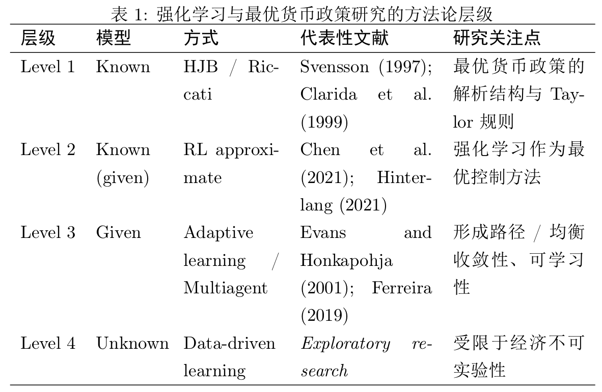
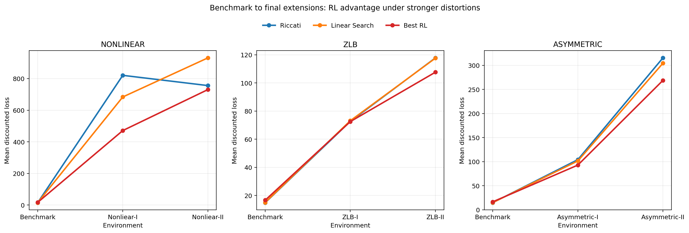
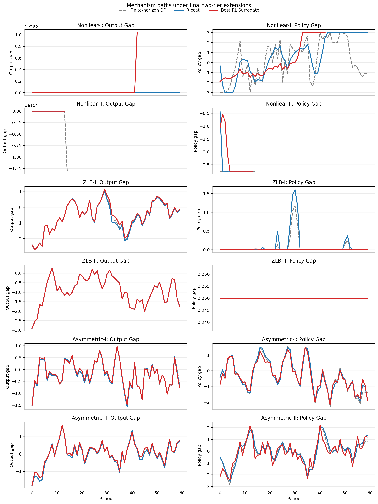
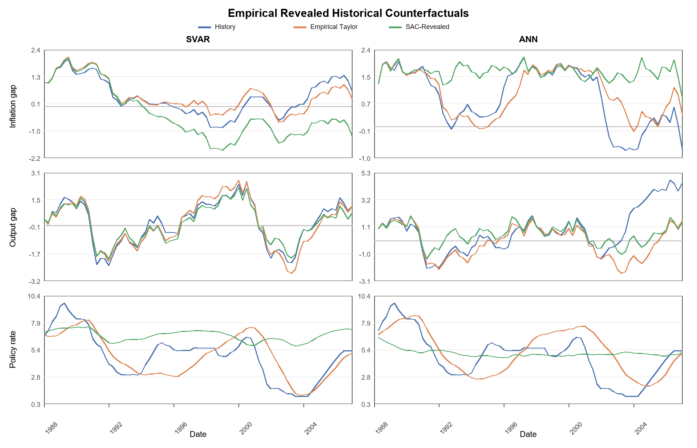
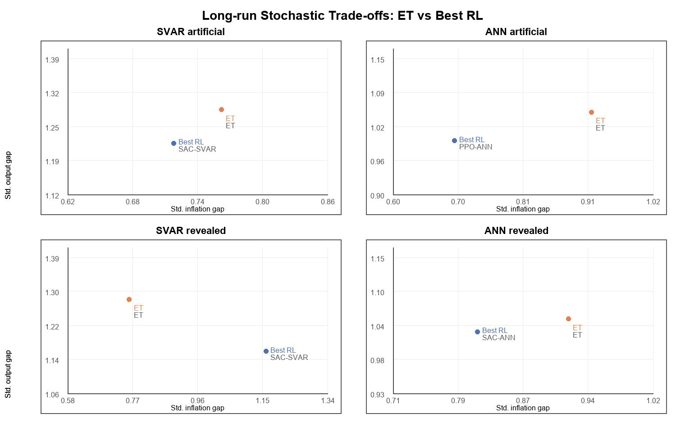
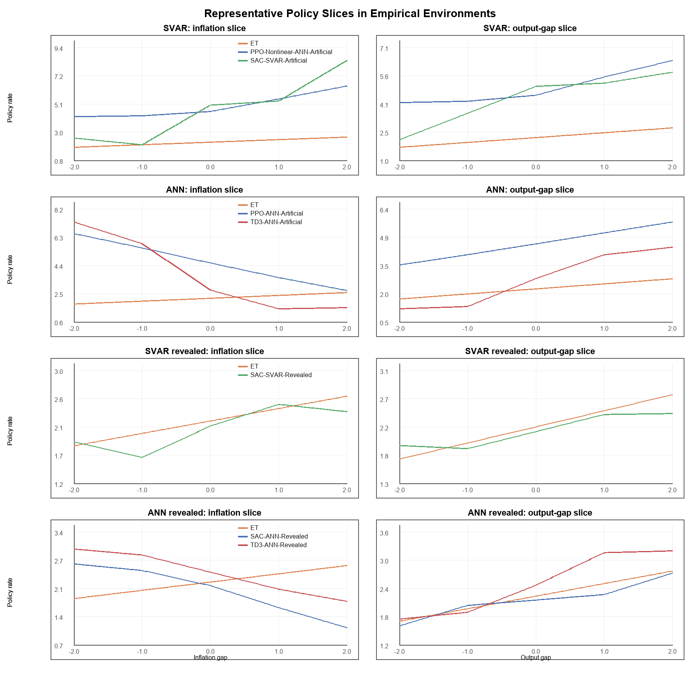

# 强化学习作为最优控制方法在货币政策模型中的应用

## 1 导论

现代宏观经济政策分析在很大程度上依赖于动态随机最优控制理论。对于最优货币政策问题，在经典框架下，当模型满足线性状态转移与二次损失函数等条件时，可以通过 Riccati 方程或 Hamilton–Jacobi–Bellman（HJB）方程求得解析解，其最优政策表现为对宏观状态变量的线性反馈规则。然而，在更为现实的情形中，政策问题往往包含非线性动态、非对称目标或政策约束等一系列特征，此时前述方程通常难以获得解析解；传统数值方法也面临维度灾难、计算开销大且不稳定等困难。

在此背景下，强化学习（Reinforcement Learning，RL）作为一种通用的动态决策算法，近年来被逐步引入经济学研究，尤其是在涉及动态规划与最优控制问题中显示出潜在优势。本文关注的核心问题是：在一个结构清晰、利用现实参数构建的宏观模型中，强化学习是否可以作为一种有效的数值方法，在央行货币政策问题中的表现如何；在可解析与不可解析的情形下，具备多大程度对经典最优政策的近似能力，能否实现更大程度的福利。本文的研究将宏观经济学中复杂政策动态规划的理论与流行的神经网络、强化学习技术相结合，寻找并分析尤其是在传统方法受限时现代方法的潜在优势与局限，试为宏观政策分析提供一种可行的数值方法框架，对理解现实政策规则的行为特征及其在各种环境下的表现具有一定启示意义。

我们将首先人工构建状态线性转移的经济体，验证强化学习得到的规则能否接近理论最优；随后考察三类经典的非基准状况下其是否具备求解优势。接着利用现实数据分别估计线性环境与非线性环境，同时利用回归得到的实际政策规则反推央行的福利目标，与强化学习得到的规则一起展开反事实分析，并分析长期随机情形下的损失与波动率的变化；进一步在更多实用的宏观经济计量模型上检验效果，探究本文提出方法的竞争力、可迁移性及局限所在。

通过我们的研究发现，合适的强化学习方法在许多情形下能超过经验泰勒规则（Taylor Rule）或历史实际政策，展现出一定程度的通用性、稳定性和可迁移性，计算效率上相比数值搜索同样具有优势，是在央行货币政策问题上极具竞争力的技术手段。

内容安排上，第二节叙述在宏观货币政策研究中应用强化学习的方法论层次，并回顾对应的主要文献成果。第三节构建理论框架，阐释基准模型，并对后续进行强化学习的环境与算法进行设定。第四节分析人工环境下各类政策规则的产出，包括线性情形与非线性情形。第五节介绍数据来源和经验环境构建，引入多种评估方式分析各类规则效果，与历史政策等进行对比，并解释所得规则的经济学行为内涵。第六节提供稳健性检验，将强化学习方法应用于多种宏观模型，并进行交叉迁移考察稳定性。第七节为讨论与总结。

## 2 文献综述

结合 IMF 的一份综述报告（2022），我们可以将应用强化学习于宏观经济领域研究的方法论大致划分为三个层级或关注面。此外表中列出第四层级以作参考，但由于宏观现实世界无法真正进行反事实检验，也尚无完整的世界模型，故仅停留于纸面讨论。

第一个层级是清晰明确的模型，通过数理手段求解并讨论相关策略；其中最优控制方法构成了规范性货币政策研究的理论基石，Svensson（1997）系统性地应用该方法，提出了通胀目标制下的最优利率规则。在新凯恩斯主义（New Keynesian，NK）模型中，Clarida、Galí 与 Gertler（1999）证明，当宏观经济系统满足线性动态、政策制定者的损失函数为二次形式（LQ 框架）时，最优货币政策问题可被表述为一个线性—二次最优控制问题；因而其求解思路与 Riccati 型 LQ 问题一致，可以通过 Riccati 方程获得解析解。此时，央行的最优政策一般将利率工具与经济状态联系起来，呈现为状态变量的线性反馈形式，具有确定性等价性质；但若不忽略央行承诺的影响，最优政策还可能表现出明显的历史依赖。这一研究路径在理论上具有高度可解释性，并为实际货币政策分析提供了重要基准。

其局限性主要体现在：一方面，LQ 假设在现实中往往难以成立；另一方面，当引入非线性通胀动态、非对称政策偏好或政策约束如零利率下限（Zero Lower Bound，ZLB）时，上述解析结果不再成立，最优政策往往表现为分段或高度非线性的函数，不再满足简单的类似 Taylor 规则的结构。这类研究通常通过数值求解 HJB 方程来获得最优政策函数，如 Woodford（2003）和 Adam and Billi（2007）所展示的那样。这一方向在理论上揭示了最优货币政策在复杂环境下的结构特征（如零利率约束下同样呈现非线性），但其数值实现（如有限差分或投影法）高度依赖于状态空间离散化，计算复杂度和稳定性方面也面临显著挑战（Adam and Billi，2006），存在包括“维数灾难”等问题。因此，尽管各类情形下最优货币政策在理论上已得到较为充分的刻画，但如何在不显式求解方程的情况下获得近似最优政策仍是一个开放问题。

第二个层级同样明确了模型结构，鉴于从央行决策者即在线策略实施者角度不一定了解模型，因此可以称为给定模型（Given）。但本层研究上不再追求解析求解模型，而是以强化学习等利用博弈经验的方式形成对较优策略的估计，同时也可理解为一个对理论模型的数值求解器。

经典工作如 Sutton and Barto（2018）表明，强化学习算法在理论上可被解释为对 Bellman 方程的随机近似求解。相关研究将强化学习引入连续时间或连续状态的随机控制问题，例如，Han, E, and Jentzen (2018) 以及 Buehler et al. (2019) 展示了深度强化学习的有效性，其能够近似求解高维偏微分方程，包括 HJB 方程。在宏观经济学领域，尝试利用强化学习分析财政或货币政策问题的相关研究尚处于快速发展阶段。Charpentier et al.（2020）系统性地将 RL 框架引入经济与金融领域的序贯交互决策问题的研究当中，指出在具有马尔可夫性质的复杂环境中，强化学习同样能有效得到传统动态规划方法难以处理的高维或非线性动态模型、博弈模型的解。

Hinterlang \& Tanzer（2021）完成了将强化学习技术系统应用于最优货币政策设计的较具开创性的工作。他们首先利用结构向量自回归模型（Structural Vector Autoregression，SVAR）与人工神经网络（Artificial Neural Network，ANN）估计美国经济的转移方程，进而采用深度确定性策略梯度（Deep Deterministic Policy Gradient，DDPG）算法学习最优利率反应函数。其研究结果表明，相较于传统泰勒规则，RL 优化的政策规则能显著降低央行的损失函数，尤其在非线性经济环境下改进幅度较大。

尽管上述研究证实了 RL 在货币政策分析中具有潜在价值，但现有文献仍存在若干不足。部分研究更侧重预测或模拟性能，缺乏与经典理论之间的系统对照；其次，对于 RL 在不同经济结构环境中所学政策规则的内在经济含义及其普适性，现有讨论仍不充分。此外，尽管这一层级也可以为私人部门固定一种预期学习，多数研究未充分考虑理性预期假设下政策规则变更可能引发的卢卡斯批判（Lucas Critique）问题，也未对所学策略的福利效应进行充分评估。在算法层面，如何平衡 RL 的探索性学习与政策可信度、可解释性也将面临来自跨学界的挑战。

本文的定位即位于此层级；且将吸收包括 Hinterlang \& Tanzer（2021）在内的前人的研究思路，考察更多样的算法，更丰富、更实际的损失口径，对非基准情形展开更为详尽的讨论，旨在全面分析强化学习规则的性能与适用性。

值得指出的是，Svensson（1997）明确指出了目标规则 （Target Rule）与工具规则（Instrument Rule）概念的区分。前者常为通过 Ramsey 最优政策问题框架得到的最优性条件（如一阶条件），强调央行对未来政策目标的承诺；后者为预设的操作指南，明确规定央行的政策工具如何直接对若干核心经济变量（如通胀、产出缺口等）做出反应。尽管 Svensson 强调鉴于工具规则缺乏灵活性和通用性，锚定目标规则是相较工具规则更好的实现方法；但在实际应用上，央行仍需根据当前具体经济结构推得合适的工具规则才能落实政策。故后文所有的研究对象本质上均为工具规则，从而可直接对比其福利效应；且我们提出的强化学习作为新手段本身具备更大的灵活性，能够在给定目标的前提下直接学习可执行的工具规则，较理论框架导出目标规则后再近似为工具规则的传统路径而言，提供了更强大、更贴合现实的方案。

此外还存在第三个层级可以区分。该层级虽然给定了模型，但参与部门均未事先掌握机制，以多智能体（Multi-Agent）的方法逐步相互学习；其学习路径具有研究意义，并会影响产出和福利。这一类研究可以划分为两部分：第一部分重点在于 RL 主体本身具备的有限理性、探索能力、经验和学习路径形成、学习过程的福利损失等话题（Shi，2022；Ashwin，2025）；第二部分为多主体学习，考察各类一般均衡的可学习性及前面所述话题。总体而言，学习主体型文献为理解现实经济中的预期形成与政策传导提供了重要视角；但由于本文的研究重点将主要落脚于第二层级，因此不对这一支文献进行过多的展开，仅阐明方法论上的区别。

## 3 理论框架

### 3.1 基准模型

本文的理论主线是要把中央银行货币政策问题写成一个带随机状态转移的离散时间的动态最优控制问题，在可解析的线性二次型下得到理论最优反馈规则作为基准；再将该问题纳入强化学习的设定框架，以让其推广到非线性或复杂环境。

我们假设经济体的一个状态由通胀偏离 $\tilde{\pi}_t$、产出缺口 $x_t$、上期利率偏离 $\tilde{i}_{t-1}$ 决定；其中 $\tilde{\pi}_t=\pi_t-\pi^\ast$，$\pi_t$ 为当期通胀率，$\pi^\ast$ 为目标通胀率；$x_t = y_t - y^\ast$，$y_t$ 为当期产出，$y^\ast$ 为目标产出；$\tilde{i}_t=i_t-i^\ast$，$i_t$ 为名义政策利率，$i^\ast$ 为稳态或中性名义利率。之所以含有上期利率 $\tilde{i}_{t-1}$，是由于央行目标中存在利率平滑项（见**式 **?），使得使得一期滞后的利率成为当前决策的必要状态变量。

故状态记为
$$
s_t=
\begin{bmatrix}
\tilde{\pi}_t \\
x_t \\
\tilde{i}_{t-1}
\end{bmatrix}
$$
$\tilde{i}_t$ 由央行本期按照政策规则决定。

同 Clarida, Galí and Gertler（1999）标准的新凯恩斯框架类似，但我们直接绕过建模包括微观基础（家庭效用、企业定价）及理性预期在内的完整 NK 结构，而采用约化形式（Reduced-form），这也便于我们后续计量分析与评估。

基准情形下状态发生线性转移，同时携带随机扰动或冲击，即
$$
s_{t+1}=A s_t + B \tilde{i}_t + \Sigma \varepsilon_{t+1}
$$
其中
$$
\varepsilon_{t+1}\sim \mathcal{N}(0,I)
$$

对于目标损失函数，我们遵循研究惯例采用包含通胀偏离和产出缺口的二次表达式（Clarida, Galí and Gertler，1999）；而后 Woodford（2003）进一步解释了其微观来源，即通过对代表性家庭的效用函数进行二阶近似，便可以得到该函数形式。

故央行的单期损失写为
$$
\ell_t=\ell(s_t,\tilde{i}_t)=\lambda_\pi \tilde{\pi}_t^2+\lambda_x x_t^2+\lambda_i(\tilde{i}_t-\tilde{i}_{t-1})^2
$$
其中 $\lambda_\pi,\lambda_x,\lambda_i$ 为可调整的权重系数。注意到目标函数其中还存在一项 $\lambda_i(\tilde{i}_t-\tilde{i}_{t-1})^2$，此利率平滑项反映了现实里央行非常重要的考量方面。

假设折现因子为 $\beta$，则长期的总损失为
$$
V(s_t)=\mathbb{E}_t\left[\sum_{k=0}^{\infty}\beta^k \ell_{t+k}\right]
$$
记成 $V(s_t)$ 表示是从状态 $s_t$ 出发的损失值函数。并用 $V^\ast(s_t)$ 记 $s_t$ 出发的最优损失值函数。

由于系统满足马尔可夫性质，最优控制问题可以写成 Bellman 最优方程：

$$
V^\ast(s)=\min_{\tilde{i}} \left\{\ell(s,\tilde{i})+\beta \mathbb{E}\left[V^\ast(s')\mid s,\tilde{i}\right]\right\}
$$

其中 $s'$ 由状态转移方程（**式 **?）给出。

将单期损失中的利率平滑项展开，可以写为

$$
\ell(s,\tilde{i})=s^\top Q s + 2 s^\top N \tilde{i} + \tilde{i}^\top R \tilde{i}
$$
其中
$$
Q=
\begin{bmatrix}
\lambda_\pi & 0 & 0 \\
0 & \lambda_x & 0 \\
0 & 0 & \lambda_i
\end{bmatrix},
\quad
N=
\begin{bmatrix}
0 \\
0 \\
-\lambda_i
\end{bmatrix},
\quad
R=\lambda_i
$$
在线性状态转移与二次损失下，对值函数的标准猜测是
$$
V(s)=s^\top P s + c
$$
其中 $P$ 为对称半正定矩阵，$c$ 为常数项。

考察 Bellman 最优方程（**式** ?）的右边得到
$$
\begin{aligned}
\mathbb{E}[V(s')\mid s,\tilde{i}]
& =
\mathbb{E}\left[(As+B\tilde{i}+\Sigma\varepsilon')^\top P(As+B\tilde{i}+\Sigma\varepsilon')+c\right]\\
& = (As+B\tilde{i})^\top P(As+B\tilde{i})+\mathrm{tr}(P\Sigma\Sigma^\top)+c\\ \\
\ell(s,\tilde{i})+\beta \mathbb{E}\left[V^\ast(s')\mid s,\tilde{i}\right] & =
s^\top Q s + 2 s^\top N \tilde{i} + \tilde{i}^\top R \tilde{i}
+ \beta (As+B\tilde{i})^\top P(As+B\tilde{i})
+ \beta \mathrm{tr}(P\Sigma\Sigma^\top)
+ \beta c
\end{aligned}
$$
将上式对 $\tilde{i}$ 求导并令其为零，整理便有
$$
\left(R+\beta B^\top P B\right)\tilde{i}
=
-\left(N^\top+\beta B^\top P A\right)s
$$
故最优反馈规则为一线性反馈
$$
\tilde{i}_t=F s_t
$$
其中 $F=-\left(R+\beta B^\top P B\right)^{-1}\left(N^\top+\beta B^\top P A\right)$ 由模型给定的系数 $A,B,N,R$ 与 $P$ 直接决定。该最优反馈代回 Bellman 最优方程可得到 $P$ 满足
$$
P
=
Q+\beta A^\top P A
-\left(N+\beta A^\top P B\right)
\left(R+\beta B^\top P B\right)^{-1}
\left(N^\top+\beta B^\top P A\right)
$$
即为离散时间的代数 Riccati 方程。

同时常数项有
$$
\begin{aligned}
c & =\beta c + \beta \mathrm{tr}(P\Sigma\Sigma^\top)\\
& =\frac{\beta}{1-\beta}\mathrm{tr}(P\Sigma\Sigma^\top)
\end{aligned}
$$
因此我们可以获得理论的最佳规则与其福利水平。后文实证中如上得到的规则将被称作 Riccati 解。

最优情形下，闭环系统的动态为
$$
s_{t+1}=(A-BF)s_t+\Sigma\varepsilon_{t+1}
$$
那么此经济体（在二阶矩意义下）稳定的条件为系数矩阵的特征值均落在单位圆内，即
$$
\rho(A-BF)<1
$$
我们的模型参数将检查并保持符合该条件。当稳定时，状态协方差矩阵 $\Omega$ 可解，其满足离散 Lyapunov 方程
$$
\Omega=(A-BF)\Omega(A-BF)^\top+\Sigma\Sigma^\top
$$
这为后续报告无条件方差、政策波动和长期福利提供理论基础。

### 3.2 强化学习设定

现在我们可把央行货币政策问题映射到马尔可夫决策过程（Markov Decision Process，MDP）上，状态仍定义为**式** ?，而动作 $a_t=\tilde{i}_t$。每一步（一期）的即时奖励为
$$
r_t=-\ell(s_t,a_t)
$$
状态间的转移仍由**式** ?给出。同样可定义状态价值函数、动作价值函数、最优价值函数及其满足的 Bellman 最优方程。
$$
\begin{aligned}
V^\pi(s)&=\mathbb{E}_\pi\left[\sum_{t=0}^\infty \gamma^t r_t \mid s_0=s\right]\\
Q^\pi(s,a)&=\mathbb{E}_\pi\left[\sum_{t=0}^\infty \gamma^t r_t \mid s_0=s,a_0=a\right]\\
V^\ast(s)&=\max_a\left\{r(s,a)+\gamma \mathbb{E}[V^\ast(s')\mid s,a]\right\}
\end{aligned}
$$
对于这一强化学习问题，我们计划考察包括 PPO、TD3、SAC 在内的多种算法。具体实现上，我们将各 RL 算法的折现参数 $\gamma$ 取为 3.1 **节**中的折现因子 $\beta$，均设为 0.99；从而使强化学习目标与货币政策最优控制问题保持一致。

PPO 是一种策略梯度类 Actor-Critic 方法。其核心思想为通过估计优势函数（动作值函数减去状态值函数）近似当前值函数对策略参数的梯度，并通过裁剪目标限制每次策略更新步长，提升训练稳定性。PPO 算法的实际优化目标可写为
$$
L^{\mathrm{clip}}(\theta)
=
\mathbb{E}\left[
\min\left(
r_t(\theta)\hat{A}_t,
\mathrm{clip}(r_t(\theta),1-\epsilon,1+\epsilon)\hat{A}_t
\right)
\right]
$$
其中
$$
r_t(\theta)=\frac{\pi_\theta(a_t\mid s_t)}{\pi_{\theta_{\text{ref}}}(a_t\mid s_t)}
$$
$\hat{A}_t$ 即为优势函数估计，可采用如下式基于时间差分（Time Difference，TD）误差的方法（注意到 PPO 还训练一个价值网络 $V_\phi(s)$ 来近似 $V(s)$）；同时目标中的期望 $\mathbb{E}$ 也应理解为利用当前样本批次的 Monte-Carlo 估计。
$$
\hat{A}_t = \sum_{l=0}^{T-t-1} (\gamma \lambda)^l \delta_{t+l} \quad \text{其中} \quad \delta_t = r_t + \gamma V_{\phi_{\text{old}}}(s_{t+1}) - V_{\phi_{\text{old}}}(s_t)
$$
对于 PPO，我们分设线性策略与非线性策略两种参数化方式；两种版本均用同一个共享特征网络与价值头，但后者采用一层线性映射作为策略头，前者则直接由一个输入当前状态的线性层给出策略。提取特征的共享网络结构为两层、每层 64 个隐藏单元的前馈网络，激活函数为 Tanh。训练核心超参数包括：clip ratio 为 0.2，策略学习率为 $3\times 10^{-4}$，价值函数学习率为 $10^{-3}$，熵系数为 $5\times 10^{-4}$，价值损失权重为 0.5，梯度裁剪阈值为 0.5 等。

TD3 则为一种确定性策略梯度类方法。其核心针对 DDPG 中普遍存在的值函数过估计问题与训练震荡问题进行了三项关键改进。第一，同时维护两个独立的目标 Q 网络 $Q_{\phi'_1}, Q_{\phi'_2}$，计算目标值时取两者较小者（Clipped Double-Q），以维持无偏估计，即
$$
r + \gamma \min_{i=1,2} Q_{\phi'_i}(s', \pi_{\theta'}(s') + \epsilon)
$$
第二，平滑正则化，向目标动作添加截断噪声 $\epsilon \sim \mathrm{clip}(\mathcal{N}(0, \sigma), -c, c)$，迫使相似动作具有相近 Q 值。第三，延迟策略更新，让 Critic 网络更新多次后，Actor 网络才更新一次。TD3 训练一个确定性策略网络 $\pi_\theta(s)$ 和两个价值网络，目标侧重于最大化动作值函数的期望，有
$$
L^{\mathrm{actor}}(\theta) = -\mathbb{E}_{s\sim\mathcal{D}}\left[ Q_{\phi_1}(s, \pi_\theta(s)) \right]
$$
TD3 的实现上 Actor 和 Critic 均为两层前馈网络，每层 64 个隐藏单元，激活函数为 ReLU。Actor 输出一维确定性动作，Critic 以“状态—动作”拼接向量为输入并输出标量 Q 值。训练时前 1000 步为纯随机探索，此后 Actor 输出动作并叠加高斯探索噪声；经验样本存入容量为 $10^{6}$ 的回放池（Replay Buffer），并以 256 的批样本量（Batch Size）进行抽样更新；软更新系数 $\tau=0.005$，学习率均设为 $3\times 10^{-4}$，探索噪声标准差为 0.2，目标策略平滑噪声为 0.15，策略延迟更新频率为 2。

SAC 基于最大熵框架，在目标函数中显式加入了策略熵项 $\mathcal{H}(\pi(\cdot|s))$（见下式，即带熵正则的 Bellman 方程），故其鼓励策略在追求高回报的同时保持足够的随机探索性。
$$
J(\pi) = \sum_t \mathbb{E}_{(s_t,a_t)} \left[ r(s_t,a_t) + \alpha \mathcal{H}(\pi(\cdot|s_t)) \right]
$$
SAC 继承了 TD3 的 Clipped Double-Q 技巧以缓解过估计。其策略损失如下式，通过重参数化技巧实现稳定梯度回传。
$$
L^{\mathrm{actor}}(\theta) = \mathbb{E}_{s\sim\mathcal{D}, \epsilon\sim\mathcal{N}} \left[ \alpha \log \pi_\theta(f_\theta(\epsilon;s)|s) - \min_{i=1,2} Q_{\phi_i}(s, f_\theta(\epsilon;s)) \right]
$$
本文所用 SAC 不维护一个自动调节的温度参数，而将其固定为 $\alpha=0.1$。采用的网络结构、主要超参数与 TD3 相同；但 Actor 网络输出动作均值与对数标准差，其中对数标准差被限制在 $([-5,1])$ 区间内，以避免数值不稳定；Critic 输出的目标 Q 值应由 $\min(Q_1,Q_2)-\alpha \log \pi(a|s)$ 构造。同时，TD3 与 SAC 属于样本利用效率更高的 Off-Policy 方法，总训练步数会明显少于 On-Policy 的 PPO。

各算法的详细流程或代码在此省略。全面的实验配置参见**附录** ?。

本文在不同环境之间尽可能保持算法超参数一致，也没有为不同环境系统性改变网络结构，后续实验均沿用相同的核心训练预算与网络规模，以保证不同环境下结果的可比性。并且选取多种实践中流行的、具有代表性的重要 RL 算法，旨在充分分析不同性质方法在政策规则学习问题上的行为表现。

除上述若干强化学习算法与 3.1 **节**所述的理论最佳（Riccati 解）以外，对 Bellman 最优方程的数值搜索解（主要应用于非基准情形）与现实中近似使用的经验泰勒（Empirical Taylor，ET）规则也是我们研究的政策对象。前者的实施细节参见 4.2 **节**；后者由最优反馈规则（**式** ?）知（该式可等价的写为）
$$
i_t = i^\ast -f_\pi(\pi_t-\pi^\ast) - f_x x_t - f_i(i_{t-1}-i^\ast)
$$
需要指出，本文所称的 Taylor 规则为其广义概念，虽表示线性形式的反应，但输入还包含滞后变量（上一期利率），且系数不定（后文中会由回归得到）。此处理论模型的 $F$ 便可给出系数 $f_\pi,f_x,f_i$（及截距），但 ET 的系数由实际数据估计得出。

## 4 人工环境结果

### 4.1 线性情形

我们首先验证在基准环境（Benchmark）下 RL 能学到有效规则；若如此则说明方法是可信的，也为后文更加复杂的求解奠定基础。

我们设定损失函数的标准权重为通胀项 $\lambda_\pi=1.0$、产出缺口项 $\lambda_x=0.5$、利率平滑项 $\lambda_i=0.1$。其他具体参数设置见下表（部分字母含义参考 3.1 **节**），更全面的参数细节位于附录。

| 重要变量     | 数值/表达式                                               |
| --------------- | --------------------------------------------------------- |
| $l$（单期损失） | $π_t^2 + 0.5 x_t^2 + 0.1(i_t-i_{t-1})^2$                  |
| $A$             | [[0.8, 0.2, 0.0], [0.05, 0.78, 0.0], [0.0, 0.0, 0.0]]     |
| $B$             | [[-0.08], [-0.12], [1.0]]                                 |
| $\Sigma$        | [[0.1719, 0.0, 0.0], [0.0, 0.4587, 0.0], [0.0, 0.0, 0.0]] |
| Horizon | 60 |
| 动作区间 | [-6.0, 6.0] |
| 初始状态采样区间 | 三维均匀分布，initial_state_low=(-2,-2,-2)，initial_state_high=(2,2,2) |
| 状态越界阈值 | 25.0 |
| 越界终止罚项 | 50.0 |

每当环境前进一期时，所执行的动作先裁剪，再加入高斯冲击；若状态越界或出现非有限值，则提前终止并扣越界终止罚项。每次评估的 Episode 数（随机重复模拟的条数）设置为 32。

我们的考察对象包括 Riccati 解、人工线性搜索（Linear Policy Search，简记为 Search）、RL 算法（包括 Linear Policy PPO、TD3、SAC，对于基准环境的 RL 训练超参数见**节** ?）及零策略、ET（来自**节** ?）。得到的平均折现损失（Mean Discounted Loss，MDL）如下表。

|    规则     |   MDL   |
| :---------: | :-----: |
|   Riccati   | 14.8791 |
|   Search    | 15.0468 |
|     SAC     | 16.6638 |
|     TD3     | 18.0437 |
|     PPO     | 21.0743 |
|     ET      | 32.2708 |
| Zero Policy | 34.4815 |

可见 RL 在 Benchmark 中确实学到了有效规则，因为三种方法的损失都显著优于经验泰勒和零策略，且几乎已达到理论最优或线性搜索解（在此问题中可较好近似理论最优的数值）。

### 4.2 非线性扩展

我们将研究多种不同形式的非基准环境，从不同角度设计破坏其线性性质，以检验方法的有效性：

其一，若状态发生一般形式的转移，即
$$
s_{t+1}=f(s_t,a_t)+\Sigma(s_t,a_t)\varepsilon_{t+1}
$$
或者分量形式如
$$
\tilde{\pi}_{t+1}=f_\pi(\tilde{\pi}_t,x_t,a_t)+\sigma_\pi \varepsilon^\pi_{t+1}\\
x_{t+1}=f_x(\tilde{\pi}_t,x_t,a_t)+\sigma_x \varepsilon^x_{t+1}
$$
则二次型值函数与线性反馈规则通常不再成立。

其二，若存在零利率下界 $i_t \ge 0$，或等价地对偏离量写成 $a_t \ge -i^\ast$，则最优策略可能呈现分段、偏折的非线性结构。

其三，若目标非对称，例如在原二次表达式后仍加有其他非对称、分段等特征的函数项，解析形式同样会被破坏。

对于上面所述的三类扩展，我们均采用两档扭曲强度，便于逐步突出本文提出方法的适用性。在实际实验上进行如下设置：

引入非线性 Phillips 曲线，形如
$$
\pi_{t+1}^{gap}=\text{linear part}
  +c_{\pi}\pi_t|\pi_t|
  +c_x x_t|x_t|
  +c_{\pi x}\pi_t x_t
  +\text{shock}
$$
其中非线性系数及其他修改参数见下表（未说明部分沿用 Benchmark，下同）

| 变量              | Nonlinear-I                           | Nonlinear-II                     |
| ----------------- | ------------------------------------- | -------------------------------- |
| A                 | [[0.77,0.18,0],[0.05,0.77,0],[0,0,0]] | 同左                             |
| B                 | [[-0.072],[-0.115],[1.0]]             | 同左                             |
| $c_\pi$           | 0.16                                  | 0.28                             |
| $c_x$             | 0.36                                  | 0.82                             |
| $c_{\pi x}$       | 0.16                                  | 0.34                             |
| 动作区间          | [-3.0, 3.0]                           | [-2.75, 2.75]                    |
| 初始状态区间      | [-3.2,3.2]×[-3.2,3.2]×[-2.8,2.8]      | [-3.0,3.0]×[-3.0,3.0]×[-2.5,2.5] |
| 状态阈值/终止罚项 | 45.0 / 220.0                          | 同左                             |

Walsh（2017）指出相对 ZLB（零利率下界），更准确的术语是 ELB（Effective Lower Bound，有效下界），即真正的限制不是 0 这一数字，而是负利率的有效性和限度，低于此下界后进一步降息无效或成本过高。因此我们在接近有效下界时引入状态依赖的衰退—通缩陷阱机制，定义
$$
\text{PolicyGap} = \max(\text{Action} - \text{LowerBound} - \text{AccommodationBuffer}, 0)\\
\text{RecessionTail} = \max(- \text{OutputGap} - \text{RecessionThreshold}, 0)\\
\text{DeflationTail} = \max(- \text{InflationGap} - \text{InflationThreshold}, 0)
$$
若 RecessionTail > 0 且 PolicyGap > 0，则下一期产出再减去 $d_\text{recession} *\text{RecessionTail * (1+RecessionTail) * PolicyGap}$，通胀再减去 $d_\text{deflation} * \text{RecessionTail * (1+DeflationTail) * PolicyGap}$。 其中

| 变量                 | ZLB-I                                | ZLB-II                               |
| -------------------- | ------------------------------------ | ------------------------------------ |
| LowerBound           | 0.0                                  | 0.25                                 |
| AccommodationBuffer  | 0.05                                 | 0.0                                  |
| RecessionThreshold   | 0.45                                 | 0.2                                  |
| InflationThreshold   | 0.2                                  | 0.05                                 |
| $d_\text{recession}$ | 0.32                                 | 0.5                                  |
| $d_\text{deflation}$ | 0.2                                  | 0.34                                 |
| 动作区间             | [0.0, 5.0]                           | [0.25, 4.25]                         |
| 初始状态区间         | [-4.0,0.15]×[-4.5,0.15]×[-0.75,0.15] | [-5.0,0.05]×[-5.5,0.05]×[-0.25,0.05] |
| 状态阈值/终止罚项    | 35.0 / 120.0                         | 40.0 / 140.0                         |

上面两者的损失函数仍是 Benchmark 所采用的二次损失。但在非对称目标上我们额外引入一阈值惩罚项；对过高的通胀缺口、过低的负产出缺口，加上高阶尾部惩罚，使之成为
$$
L_t = L_t^{base}
  +\omega_{\pi}\max(\pi_t-\bar\pi,0)^p
  +\omega_x\max(-x_t-\bar x,0)^p
$$

其中

| 变量              | Asymmetric-I                       | Asymmetric-II                        |
| ----------------- | ---------------------------------- | ------------------------------------ |
| $\bar\pi$         | 0.4                                | 0.25                                 |
| $\bar x$          | 0.45                               | 0.3                                  |
| $\omega_\pi$      | 10.0                               | 18.0                                 |
| $\omega_x$        | 9.0                                | 16.0                                 |
| $p$               | 4.0                                | 4.0                                  |
| 动作区间          | [-6.0, 6.0]                        | 同左                                 |
| 初始状态区间      | [-3.0,3.0]×[-3.0,3.0]×[-2.25,2.25] | [-3.25,3.25]×[-3.25,3.25]×[-2.5,2.5] |
| 状态阈值/终止罚项 | 30.0 / 80.0                        | 30.0 / 90.0                          |

上述配置下的实验结果见下表。传统数值动态规划（Dynamic Programming，DP）在处理这些情形的 Bellman 方程时通常需要对状态空间做网格离散。若状态维度上升，网格点数量会指数增长，这便是所谓的维数灾难（Curse of Dimensionality）。RL 的优势并不是完全消除困难，而是通过函数逼近避免对整个状态空间进行显式穷举。

尽管如此，就目前本节设计的小型模拟环境而言，我们仍可以借助一定算力获取可行的数值求解规则。故我们一并纳入以供参照；具体而言，每个问题对一定范围的状态盒均划分了 17×17×17 网格并对动作空间采样约 40-50 个离散点进行 Bellman 迭代。

| 环境类型      | Riccati Loss | 最优 RL (Method) Loss | RL 相对 Riccati 改善 | DP 数值解 Loss |
| ------------- | -----------: | --------------------: | -------------------: | -------------: |
| Nonlinear-I   |      820.784 |         (TD3) 471.190 |               42.59% |        604.462 |
| Nonlinear-II  |      756.034 |         (TD3) 730.451 |                3.38% |        916.667 |
| ZLB-I         |       72.639 |          (TD3) 72.520 |                0.16% |         65.674 |
| ZLB-II        |      117.819 |         (TD3) 107.637 |                8.64% |        105.756 |
| Asymmetric-I  |      104.265 |          (PPO) 92.935 |               10.87% |        100.950 |
| Asymmetric-II |      315.538 |         (SAC) 268.823 |               14.80% |        310.113 |

从上面的图表可见，在这些多档扩展环境中，RL 方法都已经胜过了原本的 Benchmark Riccati 解析解，体现了其能够适应强状态依赖、复杂反馈的价值。TD3 算法在扩展环境中优势明显；且优势随着约束强化而扩大，说明下界附近的最优政策更依赖状态相关的局部反应与陷阱机制。同时非二次对称目标对算法的适配程度亦具有环境依赖性。当然，有个别环境 DP 数值解在我们的运行条件下获得了比 RL 略好的损失效果，鉴于实验规模这是可以理解的；而且它们计算的时间开销已然远超过 RL。

最后，为了进一步对比与解释不同规则，我们选取若干共同冲击路径；设定其初始状态为 [1.0, -1.0, 0.0]，路径长度为 20，观察产出缺口与政策利率路径的差异。

不难发现，Riccati 外推所指导的政策路径状态依赖性不足，RL 和 DP 在部分环境中会给出明显不同的利率调整节奏，从而改变产出缺口的恢复路径。而在强 ZLB Trap 下，政策空间被压缩，规则差异主要体现在是否能更早、更稳定地贴近有效下界；在阈值型非对称损失下，简单规则又不能充分处理尾部惩罚。

相比传统解析解，RL 规则表现出更灵活的利率调整，产出缺口波动略小；同时，强非线性环境中，部分线性规则（或线性 Surrogate）路径出现不稳定，也说明 Benchmark 的线性反馈结构在更复杂的状态转移下较为脆弱。

从本节模拟环境的实验结果，足见强化学习方法对非理想或非常规情形的可用性与优越性，进一步的验证将在利用现实数据的基础上展开。

## 5 经验环境结果

### 5.1 数据

本节实验所使用的样本数据来自美国季度数据，范围为 1987Q3–2007Q2，共 80 期。其基本信息及描述统计量如下所示。数据源列为美联储经济数据库（FRED）中的宏观经济指标代码。

| 项目     | 设定                                     | 数据源        | 样本均值 | 样本标准差 |
| -------- | ---------------------------------------- | ------------- | -------- | ---------- |
| 通胀     | GDP Deflator 四季度对数增长率            | GDPDEF        | 2.433    | 0.7798     |
| 产出缺口 | 100 × (log Real GDP - log Potential GDP) | GDPC1、GDPPOT | 0.1837   | 1.2672     |
| 政策利率 | 有效联邦基金利率季度均值                 | FEDFUNDS      | 4.8373   | 2.1719     |

### 5.2 环境构建

我们借鉴 Hinterlang \& Tanzer（2021）的思路，同时构建一个线性转移的经济模型与一个非线性转移的经济模型。

对于线性模型，采用经济计量常用的 SVAR（Structural Vector Autoregression，结构向量自回归模型）方式；递归两方程，先预测 $x_{t+1}$，再用预测出的产出缺口预测 $\pi_{t+1}$；自变量包含通胀、产出缺口、若干滞后项。回归估计的结果为

| 方程         |     R² |    MSE | 表达式                                                       |
| ------------ | -----: | -----: | ------------------------------------------------------------ |
| 产出缺口方程 | 0.8702 | 0.2104 | $x_{t+1}  = 0.3066  +0.9176x_t  -0.0582\pi_t  +0.2086 i_t  -0.2375 i_{t-1}  +\varepsilon^x_{t+1}$ |
| 通胀方程     | 0.9518 | 0.0296 | $\pi_{t+1}  = 0.1254  -0.0639x_{t+1}  +0.2050x_t  -0.1070x_{t-1}  +1.2922\pi_t  -0.3159\pi_{t-1}  -0.0164 i_t  +\varepsilon^\pi_{t+1}$ |

对于非线性模型，采用近年流行的神经网络技术即 ANN（Artificial Neural Network，人工神经网络）方式；设计两个独立的单隐藏层 MLP（Multi-Layer Perceptron，多层感知机）结构，分别对应产出缺口与通胀，同样递归预测（输入预测的下一期产出缺口以预测通胀），自变量最大滞后达到三期。经过一定超参数调优后，汇总如下：

| 输出           | 输入                                                         | 隐藏层 | 激活 | 求解器 |    MSE |
| -------------- | ------------------------------------------------------------ | -----: | ---- | ------ | -----: |
| 产出缺口 $x_t$ | $x_{t-1}, π_{t-1}, i_{t-1}, i_{t-2}, x_{t-2}, π_{t-2}, i_{t-3}$ |   (3,) | ReLU | Adam   | 0.2052 |
| 通胀 $\pi_t$   | $x_t, x_{t-1}, x_{t-2}, π_{t-1}, π_{t-2}, i_{t-1}, x_{t-3}, π_{t-3}, i_{t-2}$ |   (3,) | tanh | LBFGS  | 0.0278 |

ANN 展示出了较 SVAR 更小的均方损失（MSE），符合非线性表达所具备的更强大的拟合能力。因此，上述环境能良好的作为我们实证所需的经验环境来进行规则的考察。

### 5.3 评估方法与福利识别

我们将要研究的政策对象包括

| 名称                             | 注释                                                  |
| -------------------------------- | ----------------------------------------------------- |
| History                          | 历史基准，是实际使用的政策路径                        |
| ET (Empirical Taylor)            | 经验规则                                              |
| Riccati                          | 理论参考                                              |
| Benchmark-Search/PPO/TD3/SAC     | 从人工基准环境（见**节** ?）迁移                      |
| PPO/TD3/SVAR-SVAR/ANN-Artificial | 经验环境直接训练（PPO 非线性头进一步标注 -Nonlinear） |
| PPO/TD3/SVAR-SVAR/ANN-Revealed   | 使用显示损失（见下文）在经验环境训练                  |

其中经验泰勒规则 ET 正如 3.2 **节**所述，采用历史政策数据按下式回归来获得。
$$
i_t=\alpha+\phi_\pi \pi_t+\phi_x x_t+\phi_i i_{t-1}+u_t
$$

|         指标          |  数值  |
| :-------------------: | :----: |
|        样本数         |   79   |
|          R²           | 0.9738 |
|         RMSE          | 0.3498 |
|  通胀系数 $\phi_\pi$  | 0.1932 |
| 产出缺口系数 $\phi_x$ | 0.2658 |
|   利率惯性 $\phi_i$   | 0.8692 |
|       $\alpha$        | 0.0918 |

评价时或等价转为
$$
\tilde{i}_t = 0.2166 + 0.1932(\tilde{\pi}_t) + 0.2658x_t + 0.8692(\tilde{i}_{t-1})
$$
本节设定动作（利率偏移）上下界为 [-2, 8]；通胀目标 $\pi^\ast=2\%$，中性利率 $i^\ast=2\%$。注意到线性形式规则的反应系数不因变量平移而改变，且本文所考察的非线性规则亦具备高效的学习能力，故此处目标的设定值不会带来本质影响。

在损失或福利评估上，我们除了继续使用前面设定的单期损失函数，还另外引入经实际政策近似反推所显示的单期损失函数，可更好的贴合现实中政府的目标。通过在 SVAR 经验环境中构造一个观测状态的 LQ 代理模型，固定 $\lambda_\pi=1$，利用网格搜索与 L-BFGS-B 反解产出缺口与利率平滑的权重系数，使代理模型的 Riccati 反馈尽量逼近前面得到的 Taylor 规则；最终确定显示损失的 $\lambda_x=0.8817, \lambda_i=20.0855$。这体现出真实世界里央行对跨期利率政策稳定的高度重视。

此外，对于一条政策路径，福利的评估角度和指标可以有许多种；我们将分别考察历史反事实与长期随机的情形，前者直接采用实际残差路径，后者采用回归残差池 Bootstrap。同时我们也将分析各项经济指标的方差，以便于识别规则的行为特征。

### 5.4 反事实分析

按照上**节**所列出的政策评估对象，反事实方法下样本路径的总折现损失概括于**表** ?。值得指出的是，这里假设估计得到的 Reduced-form 关系在不同政策规则下不变，因此需要面临 Lucas 批判的问题（详见**节** ?）。

| 环境-口径       | 最优 RL (Method) Loss |     ET | History |
| --------------- | --------------------: | -----: | ------: |
| SVAR-Artificial | (PPO-Nonlinear) 87.34 |  94.50 |   87.92 |
| ANN-Artificial  |           (PPO) 69.23 | 130.41 |  168.24 |
| SVAR-Revealed   |          (SAC) 148.76 | 254.74 |  375.37 |
| ANN-Revealed    |          (TD3) 186.23 | 285.35 |  483.77 |

RL 方法展现出了极强的稳定性与普适性；尤其是在较复杂、更真实的 ANN 环境，具有更为明显的大幅优势。

历史反事实的路径显示，优选 RL 规则并不是简单复制经验 Taylor 规则，而是在若干关键阶段给出更平滑或更及时的利率反应；这种路径差异使通胀与产出缺口能更快回到目标附近。

若对经验环境引入搜索方法直接求解，实际的开销对比如下：

| 方法                  | Environment Steps |
| --------------------- | :---------------- |
| ANN-Search-Artificial | 376,320           |
| ANN-Search-Revealed   | 376,320           |
| PPO-ANN-Artificial    | 225,280           |
| TD3-ANN-Artificial    | 16,000            |
| SAC-ANN-Artificial    | 16,000            |

可见 ANN 下数值搜索解训练时所使用的环境评估步数约为 PPO 的 1.67 倍、约为 TD3/SAC 的 23.5 倍；但福利损失相对于 RL 方法只有很少的改进或甚至未达到其效果。

### 5.5 长期与波动性

我们考察各类政策规则在经济体长期运行的平均折现损失。本节设定 Horizon 为 120，Episodes 为 96；随机初始状态来自样本状态池，冲击如前所述来自残差池 Bootstrap。

| 环境-口径       | 代表规则                      |  MDL | ET MDL |
| --------------- | ----------------------------- | ---: | -----: |
| SVAR-Artificial | PPO-Nonlinear-SVAR-Artificial | 1.48 |   1.62 |
| ANN-Artificial  | PPO-ANN-Artificial            | 1.12 |   2.38 |
| SVAR-Revealed   | SAC-SVAR-Revealed             | 3.05 |   3.90 |
| ANN-Revealed    | SAC-ANN-Revealed              | 3.63 |   4.31 |

数据展示出在降低平均损失方面 RL 长期优势显著；在显示央行目标下，RL 更符合其高平滑偏好。同反事实结果一样，尤其是当位于更真实的 ANN 经济中时，福利提升更加突出。

进一步地，我们分析规则作用下经济体各变量的波动率，得到下**表** ?。同时又绘制了长期随机评估中的权衡示意图与规则切片图。

| 环境 | 规则                          | 通胀波动 | 产出波动 | 利率波动 | 利率变动波动 |
| ---- | ----------------------------- | -------: | -------: | -------: | -----------: |
| SVAR | History                       |     0.75 |     1.26 |     2.19 |         0.48 |
| SVAR | PPO-Nonlinear-SVAR-Artificial |     0.80 |     1.17 |     0.90 |         0.35 |
| SVAR | SAC-SVAR-Revealed             |     1.12 |     1.07 |     0.53 |         0.14 |
| ANN  | PPO-ANN-Artificial            |     0.76 |     1.14 |     0.99 |         0.49 |
| ANN  | SAC-ANN-Revealed              |     0.82 |     1.04 |     0.91 |         0.21 |

通过上述观察，我们可以总结出其规则的经济学内涵。RL 方法所设计的政策，局部反馈更为积极和状态依赖；以略微扩大价格波动的手段高效的压低了产出与利率的波动，其中利率政策的平滑效果明显；即便不采用显示偏好的目标函数的算法也大幅稳定了利率变动。故其价值不仅体现在平均损失更低，还体现在动态稳定化能力，亦即拥有更好的通胀—产出波动组合。

## 6 稳健性分析

### 6.1 交叉迁移

我们将在不同环境训练得到的规则进行交叉迁移以验证其稳健性与可迁移性。**表** ?采用长期随机评估，平均折现损失（MDL）为比较指标；一并引入基准模型所生成的规则（来自 4 **节**）与经验 Taylor 规则，从而确认 RL 方法是否在迁移中保持了竞争力。

| 目标环境 | 本环境最优 RL (Method) MDL | 跨环境最优 RL (Method) MDL | 跨环境相对本环境改善 | 最优 Benchmark Transfer (Method) MDL | ET MDL | 跨环境相对 ET 改善 |
| -------- | -------------------------- | -------------------------- | -------------------: | ------------------------------------ | ------ | -----------------: |
| ANN      | (PPO) 78.48                | (TD3) 137.66               |              -75.41% | (TD3) 148.61                         | 159.66 |            +13.78% |
| SVAR     | (SAC) 100.12               | (PPO-Nonlinear) 98.32      |               +1.80% | (Search) 134.45                      | 111.71 |            +11.99% |

从数据可见虽然交叉迁移的跨环境规则可能逊于本环境原生规则，但依旧相对传统的泰勒规则占据了稳健优势。

### 6.2 参数稳定性

我们考察折现因子 $\beta$ 与目标函数权重 $\lambda_x,\lambda_i$ 扰动下，主要结论是否仍旧稳定。实验上每个因子分设三档，亦即分别调高与调低参数，各项情形具体数值记录如下（损失基准 $\lambda_\pi$ 保持 1.0）。

| 扰动名称      | 折现因子 $\beta$ | 产出缺口系数 $\lambda_x$ (Artificial/Revealed) | 利率平滑系数 $\lambda_i$ (Artificial/Revealed) |
| ------------- | ---------------- | ---------------------------------------------- | ---------------------------------------------- |
| Discount-High | 0.97             | 0.5/0.882                                      | 0.1/20.086                                     |
| Medium        | 0.99             | 0.5/0.882                                      | 0.1/20.086                                     |
| Discount-Low  | 0.995            | 0.5/0.882                                      | 0.1/20.086                                     |
| Output-High   | 0.99             | 1.0/1.323                                      | 0.1/20.086                                     |
| Output-Low    | 0.99             | 0.25/0.441                                     | 0.1/20.086                                     |
| Smooth-High   | 0.99             | 0.5/0.882                                      | 0.2/30.128                                     |
| Smooth-Low    | 0.99             | 0.5/0.882                                      | 0.05/10.043                                    |

对于**表 **?所列的七种情况，在 SVAR 与 ANN 环境上，分别使用 Aritificial 与 Revealed 两类口径、历史反事实与长期随机（Horizon 120，Episodes 96）两种评估角度，得到 RL 方法（不经重新训练）所带来的福利提升的范围，汇总于**表 **?。其中定义相对于 Baseline 的提升  $\text{Adv} = (\text{Baseline Loss} - \text{RL Loss}) / \text{Baseline Loss} × 100\%$。完整数据请参见附录**图** ?。

| 组别            | Adv vs History Range | Adv vs ET Range（历史反事实） | Adv vs ET Range（长期随机） |
| --------------- | -------------------: | ----------------------------: | --------------------------: |
| SVAR-Artificial |      -3.85% -- 5.26% |               1.61% -- 13.46% |            11.73% -- 15.37% |
| SVAR-Revealed   |     47.19% -- 72.44% |              32.27% -- 56.19% |            13.18% -- 39.08% |
| ANN-Artificial  |     50.26% -- 61.85% |              41.24% -- 54.95% |            45.55% -- 61.15% |
| ANN-Revealed    |     54.60% -- 65.50% |              27.89% -- 39.15% |             1.27% -- 22.04% |

近百次比较当中仅有两个情形有极轻微的劣势，且均为人工损失口径；在显示目标函数（Revealed）下强化学习规则相对历史政策、经验泰勒规则始终保持了极其稳定且显著的优势。其中 SAC 算法在大多数情形下表现最佳。以上结果充分展现了本文方法的普适性，而并非对模型参数敏感。

### 6.3 外部模型

本节将本文方法应用到许多实际宏观经济分析常用的主流模型上，进一步检验规则的可迁移性。我们分别使用美联储所开发的大规模宏观计量模型 FRB/US，属于具有 DSGE 特征的结构模型；与欧央行的模型库 MMB 中的若干较新模型，包括 NK_CW09、US_CCTW10、US_KS15 等，涵盖新凯恩斯、金融摩擦、异质性代理人等众多建模手段。

对于 FRB/US（使用 pyfrbus 库），直接迁移的结果表明规则存在明显的量级或目标结构错配；故我们利用线性搜索先得到可行基准，再分别采用 Warm-start PPO 与非线性残差微调的方法，均取得了超过模型自带 Baseline 的政策效果。 前者根据本地线性搜索生成状态动作对样本，让 PPO Actor 做监督克隆来初始化，后逐步训练线性和非线性 PPO。后者同样将搜索基准作为线性部分起始依据，并加入一个单隐层神经网络的残差部分形成规则，对其采用 PPO 训练得到（下称 Residual Fine-tune）。

| 规则                    | Artificial Loss | Revealed Loss | 相对 Baseline 改善 (Revealed) |
| ----------------------- | --------------: | ------------: | ----------------------------: |
| pyfrbus Baseline        |         0.01414 |       0.01856 |                        0.000% |
| Warmstart PPO           |         0.01276 |       0.01633 |                       12.015% |
| Warmstart PPO-Nonlinear |         0.01277 |       0.01605 |                       13.487% |
| Residual Fine-tune      |         0.01256 |       0.01594 |                       14.094% |

由**表** ?可见 RL 的确能够在央行复杂的经济模型中发挥出优势。同时，上面分析提示我们在更复杂和广泛的场景应用时需要注重原生微调，或可以将 RL 方法作为进一步优化已有规则的手段。

对于 MMB 当中的模型，除开少数因须使用线性代理需要同前类似进行初始化以匹配基本结构或避免模型失控（如 US_SW07），本文的规则在绝大部分所实验的模型里获得了相较 Baseline 显著的改进，且几乎均优于经验泰勒规则等其他方式。**表 **?展现了相关数据。

| 模型      | 最优 RL 规则      | 相对 Baseline 改善 (Revealed) |
| --------- | ----------------- | ----------------------------: |
| US_CCTW10 | TD3-SVAR          |                        96.83% |
| NK_CW09   | SAC-SVAR-Revealed |                        61.70% |
| US_CPS10  | TD3-SVAR          |                        58.51% |
| US_RA07   | SAC-SVAR          |                        52.07% |
| US_KS15   | TD3-SVAR          |                        38.21% |
| NK_CFP10  | SAC-SVAR          |                        20.56% |
| US_SW07   | SAC-SVAR-Revealed |                      -373.98% |

因此本文所提出的 RL 方法具备良好的跨模型稳健性和迁移价值，并且其还可以通过针对性微调进而再扩大增益。当然，注意到上述外部模型评价均为固定反馈规则迁移，故 Lucas 批判仍然存在。

## 7 结论

本文围绕强化学习能否作为货币政策规则的有效求解器这一问题，构建了从理论基准、非线性扩展、经验环境到外部模型稳健性的统一比较框架。全文的核心结论是：当政策问题进入非线性状态转移、有效下界约束、非对称目标以及经验福利识别等更复杂环境时，强化学习能够通过状态依赖的反馈规则取得更有竞争力、更具通用性的表现。

在人工构造的理论环境中，Benchmark 结果表明，RL 可以学习到接近经典最优反馈结构的有效规则，为后续扩展提供基准。进而引入强非线性 Phillips 曲线、ZLB/ELB 陷阱和阈值型非对称目标后，传统 Riccati 规则的外推能力明显下降，而 RL 规则的相对优势扩大。这说明 RL 的主要价值在于处理传统解析工具或线性规则外推较难覆盖的状态区间。共同冲击路径和规则切片也显示，RL 的优势并非完全不可解释：在非线性、约束或阈值附近，RL 往往通过调整通胀、产出缺口和利率平滑之间的权衡，形成区别于线性规则的局部政策反应，有效压低经济变量的波动。

在经验环境中，本文分别使用 SVAR 与 ANN 刻画美国宏观状态转移，并在人工损失与反推福利两种口径下评估历史反事实、长期随机演化和波动性表现。结果显示，经验环境内直接训练的 RL 规则能够在若干评价口径下优于经验 Taylor 规则和历史政策路径，尤其在反推福利口径下，部分 Revealed 规则表现突出。ANN 环境展现出 RL 方法极强的竞争力，同时表明非线性状态转移刻画会影响最优规则排序；但交叉迁移结果也提示，经验环境内学到的规则具有明显环境依赖性，不能简单视为跨模型普遍最优。外部模型和 FRB/US、MMB 检验提供了进一步稳健性证据，大部分模型中 RL 规则相对 Baseline 有显著改善；但不同结构模型之间存在较强异质性，对应进行微调不失为提升增益的高效办法。

因此，本文对 Lucas 批判必须保持谨慎。经验 SVAR 与 ANN 环境本质上固定了私人部门行为、政策反应与状态转移之间的历史关系，反事实政策改变并未同时触发预期形成机制和结构参数的内生调整。由此得到的 RL 改善应被解释为在给定经验模型和给定福利口径下的数值表现。

总体而言，RL 方法的优势主要体现在如下方面：它能够在多种非理想、非简单情形下直接训练得到反馈规则，减少对解析可解性的依赖；可以容纳更灵活的政策函数形式，从而捕捉传统线性规则难以表达的状态依赖反应。并且在某些高维或非线性环境中，RL 相比网格式数值搜索具有更好的计算可扩展性与更小的计算开销。不过，其同样存在一定局限：训练结果可能受算法、超参数和随机种子影响；策略函数可解释性弱于传统规则；福利排序依赖模型结构、目标函数，并不总是稳定最优。故而本文清晰的证明，强化学习方法适合作为实际复杂货币政策动态规划问题中的求解工具应用。

未来研究可以从几个方向推进。其一，在结构模型中引入政策改变后的预期重估和参数再估计，以便更直接回应 Lucas 批判。还可同时扩展状态变量与冲击结构，纳入金融条件、资产价格、财政政策和分布异质性等。其二，发展带有稳健性约束、安全约束和可解释性约束的 RL 规则，使其更接近央行实际政策评估需求。其三，在更多外部宏观模型中系统比较 RL、经典最优控制和数值搜索方法，以区分算法优势、模型适配性和目标差异。

